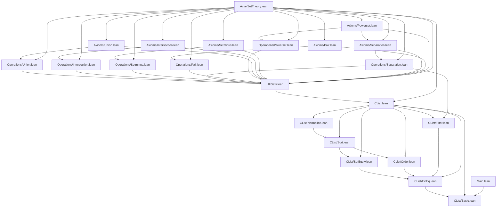

# Dependency Diagram — AczelSetTheory

**Last updated:** 2026-04-07
**Author**: Julián Calderón Almendros

## Project Structure

```text
AczelSetTheory/
├── CList/
│   ├── Basic.lean         # Core type, size, comparison, order, dedup, sort, normalize
│   ├── ExtEq.lean         # Extensional equality properties
│   ├── SetEquiv.lean      # Nodup, SetEquiv, dedup properties
│   ├── Order.lean         # lt: total strict order
│   ├── Sort.lean          # Sorted, insertionSort properties
│   ├── Normalize.lean     # Idempotency, uniqueness of normal form
│   └── Filter.lean        # filter respects extEq (P_respects, extEq_filter)
├── CList.lean             # Root import aggregating all CList sub-modules
├── HFSets.lean            # HFSet quotient type, membership, Zermelo axioms (basic)
├── Operations/
│   ├── Union.lean         # sUnion, union — CList-level definitions + HFSet lift
│   ├── Intersection.lean  # sInter, interCList
│   ├── Setminus.lean      # setminusCList, setminus
│   ├── Separation.lean    # filterCList, sep
│   ├── Pair.lean          # mkPair, pair
│   └── Powerset.lean      # powersetCList, powerset  ⚠️ 1 sorry
├── Axioms/
│   ├── Union.lean         # mem_sUnion
│   ├── Intersection.lean  # mem_sInter
│   ├── Setminus.lean      # mem_setminus
│   ├── Separation.lean    # mem_sep
│   ├── Pair.lean          # mem_mkPair
│   └── Powerset.lean      # mem_powerset  ⚠️ 1 sorry
├── Notation.lean          # Operator notation
├── _template.lean         # Module template (not imported)
└── AczelSetTheory.lean    # Project root (auto-imports all modules)
Main.lean                  # Executable entry point
```

## Dependency Graph



## Namespace Hierarchy

### 1. **CList** (CList/Basic through CList/Filter)

```lean
namespace CList
  -- CList type, definitions, order, dedup, sort, normalize (Basic)
  -- extEq properties (ExtEq)
  -- Nodup, SetEquiv (SetEquiv)
  -- lt properties (Order)
  -- Sorted, insertionSort (Sort)
  -- normalize idempotency, uniqueness (Normalize)
  -- P_respects, filter theorems (Filter)
end CList
```

### 2. **HFSet** (HFSets.lean, Operations/\*, Axioms/\*)

```lean
namespace HFSet
  -- CList.Setoid, HFSet quotient, repr, empty (HFSets)
  -- Mem, Membership, extensionality, not_mem_empty, mem_pair (HFSets)
  -- sUnion, union, mem_sUnion (Operations/Union, Axioms/Union)
  -- sInter, interCList, mem_sInter (Operations/Intersection, Axioms/Intersection)
  -- setminusCList, setminus, mem_setminus (Operations/Setminus, Axioms/Setminus)
  -- filterCList, sep, mem_sep (Operations/Separation, Axioms/Separation)
  -- mkPair, pair, mem_mkPair (Operations/Pair, Axioms/Pair)
  -- powersetCList, powerset, mem_powerset (Operations/Powerset, Axioms/Powerset)
end HFSet
```

## Dependencies by Level

### Level 0: Foundations

- `CList/Basic.lean` — no external dependencies; imports only `Init.Data.List.Basic`

### Level 1: Properties

- `CList/ExtEq.lean` — depends on Basic
- `CList/SetEquiv.lean` — depends on ExtEq
- `CList/Order.lean` — depends on ExtEq
- `CList/Filter.lean` — depends on ExtEq

### Level 2: Algorithms

- `CList/Sort.lean` — depends on Order, SetEquiv

### Level 3: Normalization

- `CList/Normalize.lean` — depends on Sort

### Level 4: Quotient

- `HFSets.lean` — depends on CList (all sub-modules via CList.lean)

### Level 5a: Operations (CList-level implementations + HFSet lift)

- `Operations/Union.lean` — depends on HFSets
- `Operations/Intersection.lean` — depends on HFSets
- `Operations/Setminus.lean` — depends on HFSets
- `Operations/Separation.lean` — depends on HFSets, CList/Filter
- `Operations/Pair.lean` — depends on HFSets
- `Operations/Powerset.lean` — depends on HFSets  ⚠️

### Level 5b: Axioms (HFSet-level statements)

- `Axioms/Union.lean` — depends on HFSets, Operations/Union
- `Axioms/Intersection.lean` — depends on HFSets, Operations/Intersection
- `Axioms/Setminus.lean` — depends on HFSets, Operations/Setminus
- `Axioms/Separation.lean` — depends on HFSets, Operations/Separation
- `Axioms/Pair.lean` — depends on HFSets, Operations/Pair
- `Axioms/Powerset.lean` — depends on HFSets, Operations/Powerset, Axioms/Separation  ⚠️

### Root

- `AczelSetTheory.lean` — imports all modules
- `Main.lean` — imports `AczelSetTheory.CList.Basic` directly (executable entry point)

## Exports by Module

### CList/Basic.lean

`CList`, `CList.mk`, `cSize`, `cSizeList`, `cSize_lt_of_mem`, `empty`, `CListOp`, `evalOp`,
`mem`, `subset`, `extEq`, `BEq CList`, `lt`, `dedupAux`, `dedup`, `orderedInsert`,
`insertionSort`, `normalize`, `zero`, `one`, `two`, `three`, `dirty`

### CList/ExtEq.lean

`subset_mono`, `subset_refl`, `extEq_refl`, `extEq_def`, `subset_nil`, `subset_cons`,
`mem_nil`, `mem_cons`, `extEq_trans`, `subset_trans`, `mem_subset`, `mem_of_extEq`, `extEq_comm`

### CList/SetEquiv.lean

`Nodup`, `dedup_nodup`, `SetEquiv`, `SetEquiv.refl/symm/trans`, `mem_eq_any`,
`extEq_mk_iff_setEquiv`, `dedup_setEquiv_self`

### CList/Order.lean

`lt_irrefl`, `lt_antisymm`, `lt_asymm`, `lt_total`, `lt_total_extEq`, `lt_trans`

### CList/Sort.lean

`Sorted`, `insertionSort_sorted`, `insertionSort_mem_subset`, `insertionSort_nodup`, `insertionSort_setEquiv`

### CList/Normalize.lean

`cSizeList_dedup_le`, `cSizeList_insertionSort_le`, `normalize_cSize_le`,
`dedup_id_of_nodup`, `insertionSort_id_of_sorted_nodup`, `normalize_idem`,
`mem_of_mem_dedup`, `sorted_nodup_setEquiv_eq`, `normalize_eq_of_extEq`

### CList/Filter.lean

`P_respects`, `subset_filter`, `mem_filter_of_mem`, `filter_subset_filter`,
`extEq_filter`, `P_of_mem_filter`

### HFSets.lean

`CList.Setoid`, `HFSet`, `HFSet.repr`, `HFSet.canonicalEq`, `HFSet.canonicalEq_iff_eq`,
`HFSet.empty`, `HFSet.Mem`, `Membership HFSet HFSet`, `HFSet.mem_mk`,
`HFSet.subset_iff_forall_mem_clist`, `HFSet.extensionality`, `HFSet.not_mem_empty`

### Operations/\*.lean

`HFSet.sUnion`, `HFSet.union`, `HFSet.sInter`, `HFSet.interCList`, `HFSet.setminusCList`,
`HFSet.setminus`, `HFSet.filterCList`, `HFSet.sep`, `HFSet.mkPair`, `HFSet.pair`,
`HFSet.sublists` (in CList ns), `HFSet.powersetCList`, `HFSet.powerset`

### Axioms/\*.lean

`HFSet.mem_sUnion`, `HFSet.mem_sInter`, `HFSet.mem_setminus`, `HFSet.mem_sep`,
`HFSet.mem_mkPair`, `HFSet.mem_powerset` (sorry)

## Design Notes

1. **16 Lean modules**: CList sub-package (7) + HFSets quotient layer (1) + Operations (6) + Axioms (6)
2. **No Mathlib** — builds entirely from Lean 4 standard library
3. **Mutual recursion**: `CList` uses `cSize` (custom size function) for termination
4. **Two-layer architecture**: `Operations/` holds CList-level constructors + HFSet lift; `Axioms/` holds only the Zermelo-style statement over HFSet
5. **One namespace for HFSet API**: all set operations live in `namespace HFSet`

## Verification Commands

```bash
lake build AczelSetTheory   # build full project
grep -r "sorry" AczelSetTheory/  # check for sorry
```
