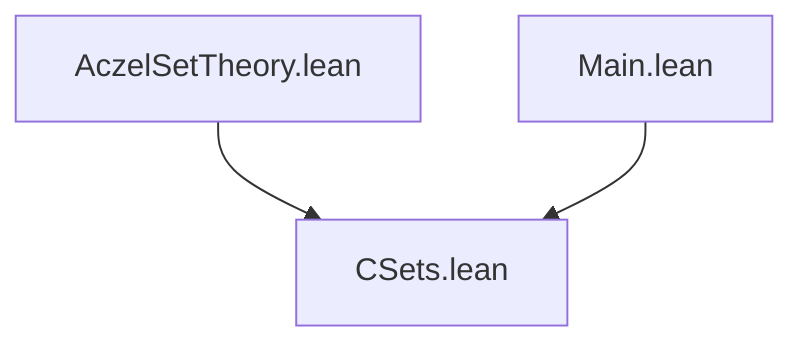

# Dependency Diagram — AczelSetTheory

**Last updated:** 2026-04-04 00:00
**Author**: Julián Calderón Almendros

## Project Structure

```
AczelSetTheory/
├── CSets.lean          # Canonical set representation (CList/CSet)
└── _template.lean      # Module template (not imported)
AczelSetTheory.lean     # Root module (auto-generated by gen-root.bash)
Main.lean               # Executable entry point
```

## Dependency Graph



*(Update this diagram as modules are added.)*

## Namespace Hierarchy

### 1. **AczelSetTheory** (root — currently in CSets.lean)

```lean
namespace AczelSetTheory
  -- CList type and all definitions
  -- Core theorems about canonical sets
```

## Dependencies by Level

### Level 0: Foundations

- `CSets.lean` — no external dependencies; imports only Lean 4 standard library (`List`, `Repr`, etc.)

### Level 1: Derived (future)

- *(modules that depend only on CSets)*

### Root

- `AczelSetTheory.lean` — imports all modules
- `Main.lean` — imports `AczelSetTheory.CSets` directly (executable entry point)

## Exports by Module

### CSets.lean

```lean
-- All public definitions in namespace AczelSetTheory:
-- CList, CSet (type definitions)
-- normalizar, insertarOrdenado, ordenarLista, ... (functions)
-- Sorted (predicate)
-- core theorems about membership, sorting, normalization
```

## Design Notes

1. **Single module currently**: all content is in `CSets.lean`
2. **No Mathlib** — builds entirely from Lean 4 standard library
3. **Mutual recursion**: `CList` and its ordering are mutually recursive (term-mode proofs)
4. **Canonical invariant**: `normalizar` is the key function maintaining the CList canonical form
5. **One namespace per module**: mirrors file path (see ADR-005 in DECISIONS.md)

## Verification Commands

```bash
make build          # build full project
make sorry          # check for sorry
make status         # lock status + sorry
```
