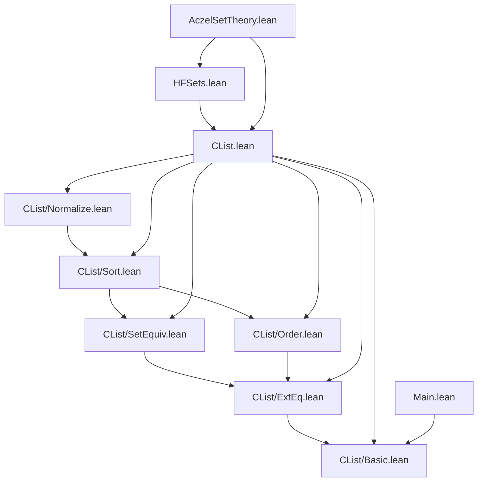

# Dependency Diagram — AczelSetTheory

**Last updated:** 2026-04-06 00:00
**Author**: Julián Calderón Almendros

## Project Structure

```
AczelSetTheory/
├── CList/
│   ├── Basic.lean       # Core type, size, comparison, order, dedup, sort, normalize
│   ├── ExtEq.lean       # Extensional equality properties
│   ├── SetEquiv.lean    # Nodup, SetEquiv, dedup properties
│   ├── Order.lean       # lt: total strict order
│   ├── Sort.lean        # Sorted, insertionSort properties
│   └── Normalize.lean   # Idempotency, uniqueness of normal form
├── CList.lean           # Root import aggregating all CList sub-modules
├── HFSets.lean          # HFSet quotient type, membership, Zermelo axioms
└── _template.lean       # Module template (not imported)
AczelSetTheory.lean      # Root module (auto-generated by gen-root.bash)
Main.lean                # Executable entry point
```

## Dependency Graph



## Namespace Hierarchy

### 1. **CList** (spans CList/Basic through CList/Normalize)

```lean
namespace CList
  -- CList type and all definitions (Basic)
  -- extEq properties (ExtEq)
  -- Nodup, SetEquiv (SetEquiv)
  -- lt properties (Order)
  -- Sorted, insertionSort (Sort)
  -- normalize idempotency, uniqueness (Normalize)
end CList
```

### 2. **HFSet** (HFSets.lean)

```lean
namespace HFSet
  -- Quotient type, repr, empty
  -- Mem, Membership instance
  -- Extensionality, not_mem_empty, pair, mem_pair
end HFSet
```

## Dependencies by Level

### Level 0: Foundations

- `CList/Basic.lean` — no external dependencies; imports only Lean 4 standard library (`Init.Data.List.Basic`)

### Level 1: Properties

- `CList/ExtEq.lean` — depends on Basic
- `CList/SetEquiv.lean` — depends on ExtEq
- `CList/Order.lean` — depends on ExtEq

### Level 2: Algorithms

- `CList/Sort.lean` — depends on Order, SetEquiv

### Level 3: Normalization

- `CList/Normalize.lean` — depends on Sort

### Level 4: Quotient

- `HFSets.lean` — depends on CList (all sub-modules via CList.lean)

### Root

- `AczelSetTheory.lean` — imports CList, HFSets
- `Main.lean` — imports `AczelSetTheory.CList.Basic` directly (executable entry point)

## Exports by Module

### CList/Basic.lean

`CList`, `CList.mk`, `CList.cSize`, `CList.cSizeList`, `CList.cSize_lt_of_mem`, `CList.empty`, `CListOp`, `CList.evalOp`, `CList.mem`, `CList.subset`, `CList.extEq`, `BEq CList`, `CList.lt`, `CList.dedupAux`, `CList.dedup`, `CList.orderedInsert`, `CList.insertionSort`, `CList.normalize`, `CList.zero`, `CList.one`, `CList.two`, `CList.three`, `CList.dirty`

### CList/ExtEq.lean

`CList.subset_mono`, `CList.subset_refl`, `CList.extEq_refl`, `CList.extEq_def`, `CList.subset_nil`, `CList.subset_cons`, `CList.mem_nil`, `CList.mem_cons`, `CList.extEq_trans`, `CList.subset_trans`, `CList.mem_subset`, `CList.mem_of_extEq`, `CList.extEq_comm`

### CList/SetEquiv.lean

`CList.Nodup`, `CList.dedup_nodup`, `CList.SetEquiv`, `CList.SetEquiv.refl`, `CList.SetEquiv.symm`, `CList.SetEquiv.trans`, `CList.mem_eq_any`, `CList.extEq_mk_iff_setEquiv`, `CList.dedup_setEquiv_self`

### CList/Order.lean

`CList.lt_irrefl`, `CList.lt_antisymm`, `CList.lt_asymm`, `CList.lt_total`, `CList.lt_total_extEq`, `CList.lt_trans`

### CList/Sort.lean

`CList.Sorted`, `CList.insertionSort_sorted`, `CList.insertionSort_mem_subset`, `CList.insertionSort_nodup`, `CList.insertionSort_setEquiv`

### CList/Normalize.lean

`CList.cSizeList_dedup_le`, `CList.cSizeList_insertionSort_le`, `CList.normalize_cSize_le`, `CList.dedup_id_of_nodup`, `CList.insertionSort_id_of_sorted_nodup`, `CList.normalize_idem`, `CList.mem_of_mem_dedup`, `CList.sorted_nodup_setEquiv_eq`

### HFSets.lean

`CList.Setoid`, `HFSet`, `HFSet.normalize_eq_of_extEq`, `HFSet.repr`, `HFSet.empty`, `HFSet.Mem`, `Membership HFSet HFSet`, `HFSet.mem_mk`, `HFSet.mkPair`, `HFSet.pair`, `HFSet.extensionality`, `HFSet.not_mem_empty`, `HFSet.mem_pair`

## Design Notes

1. **8 Lean modules**: organized in a CList sub-package + HFSets quotient layer
2. **No Mathlib** — builds entirely from Lean 4 standard library
3. **Mutual recursion**: `CList` and its ordering are mutually recursive (term-mode proofs)
4. **Canonical invariant**: `normalize` is the key function maintaining the CList canonical form
5. **One namespace per module group**: `CList` (6 sub-modules), `HFSet` (1 module)

## Verification Commands

```bash
make build          # build full project
make sorry          # check for sorry
make status         # lock status + sorry
```
