# Plan detallado — FASE B (Consolidación post-paridad)

**Creado:** 2026-06-05
**Autor:** Julián Calderón Almendros (con Copilot)
**Estado:** propuesto, pendiente de inicio

> **Estado de partida (2026-06-05)**: FASE A cerrada · 175 ficheros `.lean` · 23 034 LOC · 0 sorry · 0 noncomputable · 0 axiomas privados · build limpio (Lean v4.30.0).
> **Directiva maestra (ADR-000)**: toda teoría nueva se desarrolla **nativamente en Aczel sobre `HFSet`** (no vía transporte `VN/`); Peano queda congelado en aritmética de Robinson.

---

## 1. Objetivos estratégicos de FASE B

| Objetivo | Descripción | Salida verificable |
|---|---|---|
| **O1** | Ampliar la aritmética nativa más allá de la paridad: cuerpo `ℚ₀` extendido con valor absoluto y métrica computable. | `Integers/Rationals/{AbsVal,Metric,Density}.lean` con build limpio. |
| **O2** | Eliminar drift entre `ℤ₀` (cociente `intSetoid`) y un eventual `HFInt` (entero como HFSet); decidir representación canónica única. | ADR + `Integers/HFInt.lean` o decisión de "no formalizar". |
| **O3** | Anillos cocientes concretos: `ℤ₀/(n)` y matrices `Mₙ(ℤ₀)` apoyándose en `FinList` / `NPow` / `HFRing`. | `Algebra/QuotientRing.lean`, `Algebra/Matrix.lean`. |
| **O4** | Cierre documental de paridad: sello "Paridad completa" en `REFERENCE-Paridad-Peano-Aczel.md` y archivo de stubs VN huérfanos según ADR-000. | Doc congelada + commit "B4-DOC-FREEZE". |
| **O5** | Capa nativa `Combinatorics/` extendida (sigue ADR-000): inclusión-exclusión n-aria, principio del palomar generalizado, coeficientes binomiales sobre HFSet. | `Combinatorics/{InclExcl,Pigeonhole,Binom}.lean`. |
| **O6** | Mantener invariante 0/0/0/0 (sorry / noncomputable / axiomas / warnings) durante toda la fase. | CI manual: `lake build && make audit` tras cada milestone. |

**Criterio de cierre de FASE B**: O1–O5 entregados, O6 mantenido, `AUDIT-MODULE-MATRIX.md` regenerado, RFC C1/C2/C3 redactado para abrir FASE C.

---

## 2. Inventario de hitos (M1B–M8B)

| # | Milestone | Módulos nuevos / tocados | Dep. previa | Coste estimado |
|---|---|---|---|---:|
| **M1B** | T1+T2: auditoría de ⚠️ embebidos y migración `CosetCount` | `Algebra/CosetCount.lean`, `doc/REFERENCE-Paridad-Peano-Aczel.md` | — | 1 sesión |
| **M2B** | ℚ₀ extendido: AbsVal + Density | `Integers/Rationals/AbsVal.lean`, `…/Density.lean` | M1B (cierra T1) | 2 sesiones |
| **M3B** | ℚ₀ métrica + completitud parcial | `Integers/Rationals/Metric.lean` | M2B | 2 sesiones |
| **M4B** | ADR-001 (no HFInt) **+** representante canónico único para `ℤ₀` | `DECISIONS.md` (ADR-001), `Integers/Basic.lean` (lema `canonicalRep`) | M1B | 1 sesión |
| **M5B.0** | **Bezout extendido en `ℤ₀`** (prerrequisito de M5B) | `Integers/Bezout.lean` | M4B | 2 sesiones |
| **M5B** | Anillos cocientes concretos `ℤ₀/(n)` (incluye `IsField (ZModN p)`) | `Algebra/QuotientRing.lean` | M5B.0 | 2 sesiones |
| **M6B** | Matrices `Mₙ(ℤ₀)` + suma/producto componente a componente | `Algebra/Matrix.lean` | M5B + `NPow`/`FinList` | 2–3 sesiones |
| **M7B** | Combinatorics nativa: pigeonhole n-ario + binomiales HF | `Combinatorics/{Pigeonhole,Binom,InclExcl}.lean` | — (paralelizable) | 2 sesiones |
| **M8B** | Cierre documental + RFC C1/C2/C3 | `REFERENCE-Paridad-Peano-Aczel.md`, `THOUGHTS.md`, nuevo `RFC-FASE-C.md` | M2B…M7B | 1 sesión |

**Total estimado**: ~14–16 sesiones (≈ 7–8 semanas a ritmo histórico). Incluye sub-hito M5B.0 (Bezout) y la decisión B confirmada para M4B.

---

## 3. Grafo de dependencias

```mermaid
graph LR
  M1B[M1B · Auditoría ⚠️ + CosetCount] --> M2B[M2B · ℚ₀ AbsVal+Density]
  M1B --> M4B[M4B · ADR-001 + canonical rep]
  M2B --> M3B[M3B · ℤ₀ Métrica]
  M4B --> M5B0[M5B.0 · Bezout]
  M5B0 --> M5B[M5B · ℤ₀/&#40;n&#41;]
  M5B --> M6B[M6B · Mₙ&#40;ℤ₀&#41;]
  M7B[M7B · Combinatorics nativa]
  M3B --> M8B[M8B · Cierre + RFC C]
  M6B --> M8B
  M7B --> M8B
```



**Paralelización**:

- **M7B** no depende de nada de la cadena ℚ₀/Anillos: puede atacarse en cualquier momento.
- **M2B** y **M4B** pueden alternar sesiones tras M1B.

---

## 4. Detalle por milestone

### 4.1 M1B — Auditoría de ⚠️ embebidos + migración `CosetCount`

**Tareas heredadas** de [`NEXT_STEPS.md`](NEXT_STEPS.md) §"Tareas de mantenimiento" (T1, T2, T3):

- **T1 — Auditar ⚠️ residuales**:
  - `WellFounded §1` y `EquivRel §6` en [`doc/REFERENCE-Paridad-Peano-Aczel.md`](doc/REFERENCE-Paridad-Peano-Aczel.md).
  - Decisión por elemento: *(a)* formalizar como módulo `Axioms/`, *(b)* aceptar como embebido documentado, o *(c)* descartar.
  - **Salida**: tabla de decisiones añadida a [`DECISIONS.md`](DECISIONS.md) (ADR-002).
- **T2 — Migrar [`Algebra/CosetCount.lean`](AczelSetTheory/Algebra/CosetCount.lean)** (Lagrange abstracto) a un puente HF concreto, eliminando dependencia residual de `Peano.PeanoNat.Arith` que ya no necesita ser indirecta.
  - Rev. del API: `card_cosets_eq_card_quotient`, `lagrange_concrete`.
- **T3** (continuo): refrescar [`PLANNING.md`](PLANNING.md) y [`doc/REFERENCE-Paridad-Peano-Aczel.md`](doc/REFERENCE-Paridad-Peano-Aczel.md) con lecciones y recálculo.

**Aceptación**: [`AUDIT-MODULE-MATRIX.md`](AUDIT-MODULE-MATRIX.md) regenerado, ADR-002 redactado, build invariante.

---

### 4.2 M2B — ℚ₀ extendido: valor absoluto + densidad

**Módulo nuevo**: `AczelSetTheory/Integers/Rationals/AbsVal.lean`.

**API mínima**:

```lean
def absVal : ℚ₀ → ℚ₀                          -- |q| computable
theorem absVal_nonneg     : 0 ≤ |q|
theorem absVal_zero_iff   : |q| = 0 ↔ q = 0
theorem absVal_neg        : |-q| = |q|
theorem absVal_mul        : |p * q| = |p| * |q|
theorem absVal_triangle   : |p + q| ≤ |p| + |q|
```

**Módulo nuevo**: `…/Density.lean`:

```lean
theorem rat_density : ∀ p q : ℚ₀, p < q → ∃ r, p < r ∧ r < q
-- testigo computable: r := (p + q) / 2
```

**Riesgo**: división por 2 sobre `ℚ₀`; verificar que el cociente `intSetoid` admite multiplicación/inverso de `2` sin reintroducir `noncomputable`.

---

### 4.3 M3B — ℚ₀ métrica y completitud parcial

**Módulo nuevo**: `…/Metric.lean`.

**API**:

```lean
def dist (p q : ℚ₀) : ℚ₀ := |p - q|
theorem dist_self        : dist p p = 0
theorem dist_comm        : dist p q = dist q p
theorem dist_triangle    : dist p r ≤ dist p q + dist q r
def IsCauchy (s : ℕ₀ → ℚ₀) : Prop :=
  ∀ ε > 0, ∃ N, ∀ m n ≥ N, dist (s m) (s n) < ε
```

**Definición alternativa computable** (decisión del usuario, 2026-06-05):
además de la definición clásica con `ε > 0` arbitrario, se requiere una **versión diádica** con ε = 2^(−δ):

```lean
/-- Cauchy diádico: para todo δ : ℕ₀ existe N tal que dist (s m) (s n) < 1 / 2^δ. -/
def IsCauchy₂ (s : ℕ₀ → ℚ₀) : Prop :=
  ∀ δ : ℕ₀, ∃ N : ℕ₀, ∀ m n : ℕ₀, N ≤ m → N ≤ n →
    dist (s m) (s n) < 1 / pow2 δ

theorem isCauchy₂_iff_isCauchy : IsCauchy₂ s ↔ IsCauchy s
```

**Justificación**: `IsCauchy₂` es la forma utilizable para construir números computables (reales constructivos al estilo Bishop): el módulo de convergencia `N : ℕ₀ → ℕ₀` con `N δ` testigo de la cota se vuelve un **dato computable**, no una función no constructiva sobre ℝ. La definición clásica con ε ∈ ℚ₀>0 queda como conveniencia, pero todos los teoremas operativos pasan por `IsCauchy₂`.

**Lemas auxiliares necesarios**:

```lean
def pow2 : ℕ₀ → ℕ₀                                  -- 2^n nativo en ℕ₀
theorem pow2_pos       : pow2 δ > 0
theorem pow2_succ      : pow2 (σ δ) = 2 · pow2 δ
theorem one_div_pow2_pos : (1 : ℚ₀) / pow2 δ > 0
-- equivalencia con la definición clásica:
theorem isCauchy_of_isCauchy₂ : IsCauchy₂ s → IsCauchy s
theorem isCauchy₂_of_isCauchy : IsCauchy s → IsCauchy₂ s   -- usa que ∀ε>0 ∃δ 1/2^δ < ε
```

**Completitud parcial**: probar que sucesiones acotadas con valores en una `HFSet` finita son eventualmente constantes ⇒ trivialmente Cauchy ⇒ convergentes. (No se prueba completitud total: `ℚ₀` no es completo y eso requiere ASet₁ ⇒ FASE C.)

**Aceptación**: `Metric.lean` con build limpio; `IsCauchy₂` y la equivalencia probadas; ningún axioma adicional usado (`#print axioms` solo `propext, Classical.choice, Quot.sound`).

---

### 4.4 M4B — ADR-001 (no HFInt) + representante canónico único

**Decisión del usuario (2026-06-05)**: opción **B** — *no se introducirá `HFInt`* hasta que ASet₁ lo demande. **Adicionalmente** se exige fijar una **forma canónica única** para los representantes de las clases de `ℤ₀`.

**Forma canónica**: cada clase `(a, b) ∈ ℤ₀` tiene un representante canónico de la forma

- `(0, n)` con `n ∈ ℕ₀` si la clase es `≥ 0` (representando el entero `n`), **o**
- `(n, 0)` con `n ∈ ℕ₀`, `n ≠ 0` si la clase es `< 0` (representando `−n`).

**API a añadir** en `AczelSetTheory/Integers/Basic.lean`:

```lean
/-- Representante canónico: una de las formas (0, n) o (n, 0). -/
def canonicalRep : ℕ₀ × ℕ₀ → ℕ₀ × ℕ₀
  | (a, b) => if b ≤ a then (a -₀ b, 0) else (0, b -₀ a)

theorem canonicalRep_idempotent : canonicalRep (canonicalRep p) = canonicalRep p
theorem canonicalRep_equiv      : intSetoid.r p (canonicalRep p)
theorem canonicalRep_unique     :
    intSetoid.r p q → canonicalRep p = canonicalRep q

/-- Función nativa de `ℤ₀` a su representante canónico (con `Quotient.lift`). -/
def ℤ₀.repr : ℤ₀ → ℕ₀ × ℕ₀

theorem ℤ₀.mk_repr : ℤ₀.repr z = z
theorem ℤ₀.repr_mk_canonical : ℤ₀.repr p = canonicalRep p
```

**Justificación**:

1. La forma canónica desambigua todas las pruebas de igualdad sobre `ℤ₀` y permite igualdad decidible reducible (`DecidableEq ℤ₀` vía `decEq` sobre el par representante).
2. Es prerequisito limpio para M5B.0 (Bezout): el algoritmo necesita extraer `(a, b)` con `a` o `b` igual a 0 sin ramas adicionales.
3. ADR-001 cierra la pregunta `HFInt` formalmente; toda referencia a un "entero como HFSet" se redirige a `ℤ₀`.

**Aceptación**:

- ADR-001 commiteada en [`DECISIONS.md`](DECISIONS.md).
- `canonicalRep`, `canonicalRep_idempotent`, `canonicalRep_equiv`, `canonicalRep_unique`, `ℤ₀.repr`, `ℤ₀.mk_repr` probados en `Integers/Basic.lean` (o nuevo `Integers/Canonical.lean`).
- Build limpio, instancia `DecidableEq ℤ₀` reducida a `DecidableEq (ℕ₀ × ℕ₀)` vía `canonicalRep`.

---

### 4.5a M5B.0 — Bezout extendido en `ℤ₀`

**Módulo nuevo**: `AczelSetTheory/Integers/Bezout.lean`.

**Decisión del usuario (2026-06-05)**: se requiere Bezout en `ℤ₀` antes de poder probar `IsField (ZModN p)`.

**API mínima**:

```lean
/-- Algoritmo de Euclides extendido sobre ℤ₀: dados a, b devuelve (g, x, y) con
    g = gcd(|a|, |b|) y a*x + b*y = g. -/
def bezout : ℤ₀ → ℤ₀ → ℤ₀ × ℤ₀ × ℤ₀

theorem bezout_gcd        : (bezout a b).1 = gcd a b              -- gcd ya en ℕ₀
theorem bezout_eq         : let (g, x, y) := bezout a b
                            a * x + b * y = g
theorem bezout_gcd_pos    : a ≠ 0 ∨ b ≠ 0 → 0 < (bezout a b).1
theorem bezout_coprime    : gcd a b = 1 →
                            ∃ x y : ℤ₀, a * x + b * y = 1
```

**Apoyo**: aprovechar `Peano.PeanoNat.Div`/`Peano.PeanoNat.Gcd` ya importables (ADR-000 permite uso de Peano para fundamentos aritméticos), elevar el algoritmo a `ℤ₀` con la representación canónica de M4B.

**Riesgo**: prueba de terminación del Euclides extendido sobre `ℕ₀` en Lean 4 — mitigación: usar `Peano`'s `gcd` ya terminado y reconstruir los coeficientes (o `WellFoundedRecursion` sobre `(ℕ₀, <)`).

**Aceptación**: `bezout`, `bezout_eq`, `bezout_coprime` probados; build limpio; único axioma clásico admisible es `Classical.choice` si hace falta para `WellFoundedRecursion` (preferible no usar nada clásico si se reduce a `Peano.gcd`).

---

### 4.5b M5B — Anillos cociente `ℤ₀/(n)`

**Módulo nuevo**: `AczelSetTheory/Algebra/QuotientRing.lean`.

**Definición**:

```lean
structure HFIdeal (R : HFRing) where
  I : HFSet
  zero_mem    : R.zero ∈ I
  add_closed  : ∀ {a b}, a ∈ I → b ∈ I → R.add a b ∈ I
  absorb_mul  : ∀ {a r}, a ∈ I → r ∈ R.R → R.mul r a ∈ I

def HFRing.quotient (R : HFRing) (I : HFIdeal R) : HFRing := …

def ZModN (n : ℕ₀) : HFRing :=
  (HFRing_of_ℤ₀).quotient (idealMul n)
```

**Teoremas clave**: `card (ZModN n).R = n` para `n > 0`; `ZModN p` es cuerpo si `p` es primo (encadena con [`Algebra/Field.lean`](AczelSetTheory/Algebra/Field.lean)).

**Construcción del inverso modular** vía `bezout` (M5B.0): para `[a] ∈ (ZModN p)*` con `gcd a p = 1` se obtiene `x` tal que `a * x ≡ 1 (mod p)`, definiendo `inv [a] := [x]`.

**Riesgo principal** — *resuelto*: M5B.0 cubre Bezout. Riesgo residual: probar `well-defined` del inverso modular (independiente del representante en la clase) usando `canonicalRep` de M4B.

---

### 4.6 M6B — Matrices `Mₙ(ℤ₀)`

**Módulo nuevo**: `AczelSetTheory/Algebra/Matrix.lean`.

**Representación**: `Matrix n m R := FinList n (FinList m R.R)` (apoyado en `FinList` y `NPow`).

**API mínima**:

```lean
def Matrix.zero, Matrix.one (cuadradas), Matrix.add, Matrix.mul, Matrix.transpose
theorem matrix_add_assoc, matrix_mul_assoc, matrix_distrib
instance HFRing (Matrix n n R)              -- para n cuadradas
```

**Determinante**: queda **fuera de M6B** y se difiere a FASE C (requiere `Sign` n-ario sobre `HFSet`, no sólo el `Sign` por permutaciones que pudo haber existido).

---

### 4.7 M7B — Combinatorics nativa (paralelizable)

**Módulos nuevos** dentro de `AczelSetTheory/Combinatorics/`:

| Módulo | Contenido |
|---|---|
| `Pigeonhole.lean` | `pigeonhole_n : card A > n · card B → ∃ b ∈ B, card (preimg b) > n` |
| `Binom.lean` | `binom : ℕ₀ → ℕ₀ → ℕ₀` nativa HF + Pascal + identidad de Vandermonde |
| `InclExcl.lean` | Generalización n-aria del principio inclusión-exclusión (extiende el caso 2 ya presente en `Combinatorics/Counting.lean`) |

**Ventaja estratégica**: cumple ADR-000 (capa nativa, no `VN/`). Independiente de M2B–M6B.

---

### 4.8 M8B — Cierre documental + RFC FASE C

**Tareas**:

1. Sello **"Paridad completa"** en [`doc/REFERENCE-Paridad-Peano-Aczel.md`](doc/REFERENCE-Paridad-Peano-Aczel.md) con tabla 0 ❌.
2. Mover stubs huérfanos `VN/CountingVN.lean`, `VN/SignVN.lean` a `archive/` (o anotarlos `@[deprecated]` con comentario ADR-000).
3. Redactar `RFC-FASE-C.md` con tres opciones explícitas:
   - **C1** Profundizar en HF (topología avanzada, categorías pequeñas).
   - **C2** Comenzar **ASet₁** (subconjuntos Δ⁰₁ infinitos; abre análisis real).
   - **C3** Atacar **ZFC vía W-Types**.
4. Actualizar [`CHANGELOG.md`](CHANGELOG.md) con entrada `[2026-XX-YY] — FASE B cerrada`.
5. Regenerar [`AUDIT-MODULE-MATRIX.md`](AUDIT-MODULE-MATRIX.md) y [`REFERENCE.md`](REFERENCE.md); pegar `lake build` final en el changelog.

---

## 5. Política de invariantes durante FASE B

| Invariante | Verificación | Periodicidad |
|---|---|---|
| `lake build` 0 errores / 0 warnings | terminal | tras cada commit |
| 0 `sorry` reales | `Select-String '\bsorry\b'` excluyendo `test_sorry.lean` | tras cada milestone |
| 0 `noncomputable def` | `grep '^\s*noncomputable\s+def'` | tras cada milestone |
| 0 `axiom` declarados | `grep '^\s*axiom\s'` | tras cada milestone |
| `#print axioms <símbolo_clave>` ⊆ `{propext, Classical.choice, Quot.sound}` | manual en teoremas finales de cada milestone | M2B, M3B, M5B, M6B |
| Matriz de auditoría sincronizada | regen automático del script de M1B | tras cada milestone |
| Documentación derivada al día | `REFERENCE.md` + `doc/REFERENCE-*.md` correspondientes | tras cada milestone |

---

## 6. Riesgos y mitigaciones

| Riesgo | Probabilidad | Impacto | Mitigación |
|---|---|---|---|
| División por 2 reintroduce `noncomputable` en M2B | Media | Alto | Adelantar verificación con prototipo mínimo antes de M2B; si surge, pivotar a definición vía `Quot.lift` con representante computable. |
| Equivalencia `IsCauchy₂ ↔ IsCauchy` requiere existencia de `δ` con `1/2^δ < ε` para `ε ∈ ℚ₀>0` | Media | Bajo | Lema arquimédico de ℚ₀: `∀ ε>0, ∃ δ, 1/2^δ < ε` vía iteración acotada por el numerador; demostrar antes de M3B. |
| Bezout en `ℤ₀` no termina o requiere clasicalidad pesada | Media | Medio | M5B.0 dedicado; usar `Peano.gcd` como base y añadir reconstrucción de coeficientes con recursión bien fundada sobre `min(a, b)`. |
| Forma canónica `(0, n)` / `(n, 0)` no respeta una operación del anillo | Baja | Medio | Probar lema `canonicalRep_unique` y usar siempre `ℤ₀.repr` como interfaz; no asumir que las operaciones devuelven directamente la forma canónica. |
| Drift `ℤ₀`/`HFInt` no se resuelve y bloquea M5B | — *resuelto* | — | ADR-001 confirmada (opción B): no se introduce `HFInt` en FASE B. |
| Tamaño de [`Algebra/Sylow.lean`](AczelSetTheory/Algebra/Sylow.lean) (3 516 LOC) hace lentos los rebuilds incrementales | Media | Bajo | No tocar ese módulo en FASE B; refactor diferido a FASE C. |
| ADR-000 conflicto con `VN/CountingVN.lean` ya existente | Baja | Bajo | M8B archiva o marca deprecated. |

---

## 7. Decisión recomendada para iniciar

Empezar por **M1B (auditoría ⚠️ + CosetCount)** porque:

1. Es prerequisito formal de M2B y M4B.
2. Cierra deuda histórica de [`NEXT_STEPS.md`](NEXT_STEPS.md) (T1, T2, T3).
3. Coste bajo (1 sesión) — produce momentum.
4. Genera el **ADR-002** que estabiliza el frente Peano antes de avanzar a ℚ₀.

En paralelo, si se quiere obtener avance visible rápido, **M7B (Combinatorics nativa)** puede atacarse simultáneamente: no comparte ficheros con M1B y materializa la directiva ADR-000.

---

## 8. Trazabilidad

- **Origen del plan**: `PLANNING.md` §🅱️ (esquema de 4 puntos B1–B4) + ADR-000 (Peano congelado).
- **Plan ampliado**: este documento (8 milestones M1B–M8B con dependencias, riesgos e invariantes).
- **Próxima revisión**: tras M1B (cierre de auditoría ⚠️) — recalcular costes restantes.

---

*Documento vivo. Actualizar tras cada milestone con: lecciones aprendidas, recálculo de coste, ajuste de orden si surgen bloqueos.*

---

## 9. Decisiones del usuario (2026-06-05)

Aprobaciones recibidas y reflejadas en este plan:

1. ✅ **Cauchy diádico** (`IsCauchy₂` con ε = 2⁻ᵟ) añadido a M3B como definición canónica para números computables, con equivalencia probada respecto a la versión clásica.
2. ✅ **M4B = opción B** (no `HFInt`) **+** representante canónico único `(0, n)` o `(n, 0)` formalizado vía `canonicalRep`, `ℤ₀.repr`, `canonicalRep_unique`.
3. ✅ **Bezout extendido en `ℤ₀`** elevado a sub-hito propio **M5B.0** (prerrequisito de M5B), módulo `Integers/Bezout.lean`.
4. ✅ **Inicio en M1B** (auditoría ⚠️ + migración `CosetCount`).

